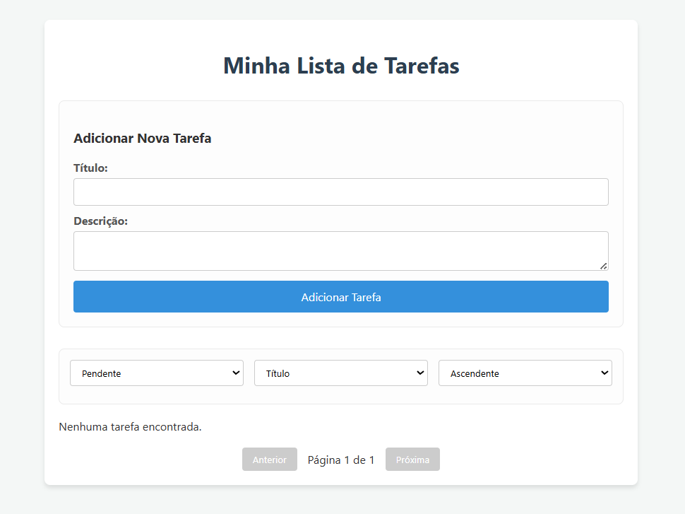
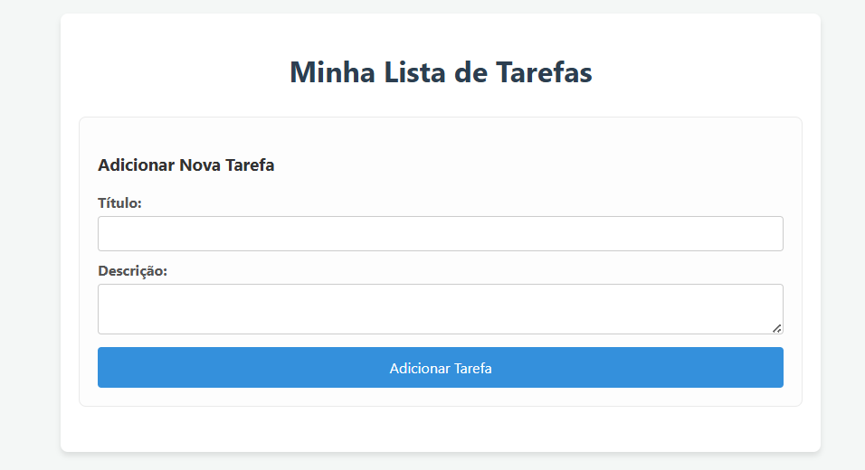
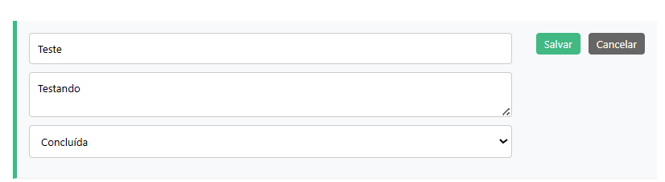
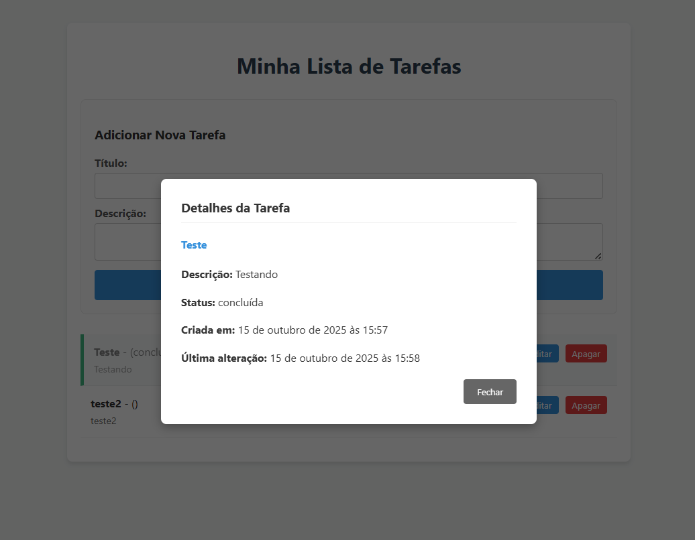

# Front-End da Lista de Tarefas (To-Do List) - Desafio de Programação

Esta é a Single Page Application (SPA) desenvolvida como front-end para o desafio de programação. A aplicação foi construída com **Vue.js** e interage com a [API em Laravel](https://github.com/ThiagoZanardi05/desafio-raizato-api.git) para fornecer uma experiência de usuário reativa e moderna para o gerenciamento de tarefas.

## Sobre o Projeto

O objetivo deste projeto é consumir a API de tarefas, permitindo que o usuário visualize, crie, edite, apague e veja os detalhes das suas tarefas em uma interface limpa e intuitiva. A aplicação foi estruturada com foco na componentização e na reatividade, que são pontos fortes do Vue.js.

## Tecnologias e Conceitos Utilizados

- **Framework:** Vue.js 3 (com a Composition API e `<script setup>`)
- **Linguagem:** JavaScript
- **Roteamento:** Vue Router
- **Cliente HTTP:** Axios para a comunicação com a API.
- **Ferramentas de Build:** Vite
- **Qualidade de Código:** ESLint e Prettier

### Estrutura de Componentes

A aplicação foi dividida nos seguintes componentes para garantir a separação de responsabilidades e a reutilização:
- `HomeView.vue`: A página principal que gerencia o estado da lista de tarefas.
- `TaskItem.vue`: Componente que representa uma única tarefa na lista, contendo a lógica para edição, exclusão e exibição.
- `CreateTaskForm.vue`: Formulário para a criação de novas tarefas.
- `TaskDetailModal.vue`: Modal para a exibição dos detalhes completos de uma tarefa.

## Demonstração Visual

Abaixo estão algumas telas que demonstram as principais funcionalidades da aplicação.

### 1. Visualização da Lista
A tela principal exibe todas as tarefas. Tarefas concluídas são visualmente diferenciadas com uma borda verde e texto riscado, oferecendo uma clara indicação de status.



### 2. Criação de Tarefa
Um formulário limpo e intuitivo permite a adição de novas tarefas à lista.



### 3. Modo de Edição
Ao clicar em "Editar", a tarefa entra em modo de edição, permitindo a alteração de título, descrição e status diretamente na lista.



### 4. Detalhes da Tarefa
Clicar em uma tarefa abre um modal com todos os seus detalhes, incluindo as datas de criação e última alteração.



## Como Executar o Projeto Localmente

Siga os passos abaixo para configurar e rodar o front-end em seu ambiente de desenvolvimento.

### Pré-requisitos

- Node.js (versão 18 ou superior) e npm.
- A **API em Laravel** deve estar rodando localmente.

### Passos para Instalação

1.  **Clone o repositório:**
    ```bash
    git clone https://github.com/ThiagoZanardi05/frontend-challenge.git
    cd seu-repositorio-frontend
    ```

2.  **Instale as dependências do npm:**
    ```bash
    npm install
    ```

3.  **Inicie o servidor de desenvolvimento:**
    ```bash
    npm run dev
    ```

A aplicação estará disponível em `http://localhost:5173` (ou em outra porta, caso a 5173 esteja em uso).

---
*Este projeto foi desenvolvido como parte de um desafio de programação.*
